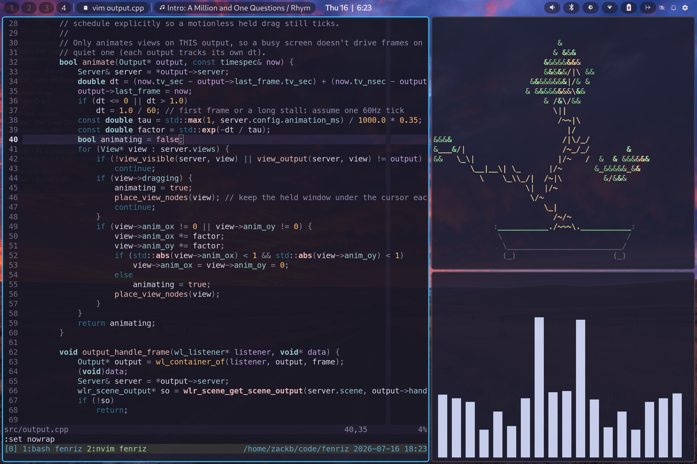

# fenriz

A minimal tiling Wayland compositor built on [wlroots](https://gitlab.freedesktop.org/wlroots/wlroots)
and [SceneFX](https://github.com/wlrfx/scenefx).

<p align="center">
  
</p>

A Hyprland/niri alternative for minimalists. The goal is a compositor that is small,
fast, and stays out of the way. Performance and stability are the primary goals over
tons of features and eye-candy. It tiles your windows, reads a config file, speaks a small [IPC](/docs/IPC.md), and otherwise
does nothing you didn't ask for.

## Goals

- Great tiling support: dwindle BSP layout, floating, fullscreen, and per-window rules.
- As performant as possible, with a small codebase, minimal dependencies, and extremely low resource use.
- Stable and predictable: no surprises, no crashes, no memory leaks, no breaking changes every other release.
- Perfect multi-monitor and clamshell support out of the box (see #multi-monitor-and-clamshell).
- Integration with existing Wayland tools: quickshell, swaybar, waybar, wlogout, wdisplays, wlr-randr, etc.

## Status

Usable daily driver. Brings up outputs (multi-monitor + clamshell), tiles xdg-shell
windows in a dwindle BSP layout, floating and fullscreen, keyboard/pointer input with
config keybinds and click/drag-to-move/resize. Rendering is via wlr_scene + SceneFX:
borders, per-window opacity, rounded corners, and an optional soft shadow. Includes a
session lock, and a set of the common wlroots protocols (foreign-toplevel/taskbar,
fractional scale, xdg-activation, gamma/output-power, data-control, screencopy, …).

XWayland: managed X11 toplevels (games, IDEs, older GTK/Qt apps) tile and focus like
native windows. Override-redirect popups (X11 menus/tooltips) aren't handled yet.

## Dependencies

wlroots 0.20, scenefx 0.5, wayland-server, xkbcommon, pixman, libinput, EGL, GLESv2.
On Arch:

```
sudo pacman -S wlroots wayland xkbcommon pixman libinput mesa
```

scenefx (`scenefx-0.5`) is not in the official repos; install from the AUR or build it.
Also needs `cmake` (>= 3.19) and `ninja`.

## Build

```
make debug      # configure + build into build/debug
make release
make test       # run the config/tiling/keybind/output self-checks
make run        # build debug and launch
```

## Run

```
make install      # install to /usr/local/bin/fenriz
fenriz            # launch the compositor (from a TTY or inside an existing Wayland session)
```

## Multi-monitor and clamshell

***[None](https://github.com/Kore29/hyprland-clamshell) [of](https://adamhollister.com/hyprland-clamshell-mode) [this](https://github.com/chris4540/hyprland-clamshell) [needs](https://www.reddit.com/r/hyprland/comments/1bzc05s/monitor_not_detected_on_docking_station/) [configuring](https://github.com/zackb/dots/blob/main/.config/hypr/clamshell.lua)***. Each of the 10 workspaces lives on one output. When a
screen goes away — lid shut, cable pulled, suspend — its workspaces move to a surviving
screen with layouts and focus intact, and return exactly where they were when it comes
back. The internal panel turns off when the lid shuts with an external connected, and back
on otherwise; suspend-on-lid is left to logind, which already gets it right.

Your bar does not need reloading on monitor change: disabling a screen removes its
`wl_output` global, so a per-screen shell rebuilds through the normal registry events.

Override the defaults only if you want to:

```
output    = eDP-1, preferred, auto, 2.0    # per-screen mode/position/scale
output    = DP-1,  3840x2160@144, auto, 1.0
workspace = 3, DP-1                        # pin ws3 to the big monitor, always
```

## Screen sharing

fenriz exposes `wlr-screencopy`, so screen sharing in Zoom, Discord, OBS, and
browser apps (Google Meet, etc.) works through `xdg-desktop-portal` and its wlroots
backend. You'll need to install the runtime pieces and make sure the user services are running:

```
sudo pacman -S xdg-desktop-portal xdg-desktop-portal-wlr pipewire wireplumber
```

fenriz sets `XDG_CURRENT_DESKTOP=fenriz:wlroots` and installs
`fenriz-portals.conf`, which routes `ScreenCast`/`RemoteDesktop` to the `wlr` backend automatically.

## IPC

fenriz exposes a Unix socket (`FENRIZ_SOCKET`) that streams workspace/window/output state
as newline-delimited JSON and accepts one-line commands — for status bars and shells. See
[docs/IPC.md](docs/IPC.md).

## Layout

```
src/
  main.cpp        entry + event loop
  server.*        backend, renderer, allocator, xdg-shell, seat, protocols; owns the window list
  output.*        outputs: frame handler, hotplug, enable/disable, clamshell policy
  output_policy.cpp   pure workspace-assignment rules (evacuate/restore); no wlroots, unit-tested
  view.*          xdg_toplevel wrapper: geometry, focus, floating/fullscreen, scene nodes
  tiling.*        dwindle BSP layout
  cursor.*        pointer focus + interactive move/resize
  keyboard.*      xkb + keybind dispatch
  layer.*         wlr-layer-shell (bars/panels/wallpapers) + idle-notify
  decoration.*    force server-side decoration (xdg-decoration); fenriz draws the border
  lock.*          session lock (ext-session-lock)
  ipc.*           FENRIZ_SOCKET control socket (see docs/IPC.md)
  config.*        Hyprland-style config parser
```
