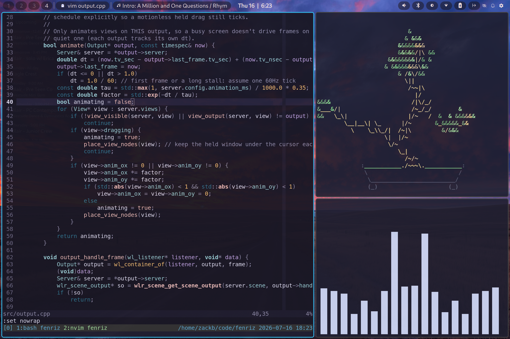

# fenriz

A fast, stable tiling Wayland compositor built on [wlroots](https://gitlab.freedesktop.org/wlroots/wlroots)
and [SceneFX](https://github.com/wlrfx/scenefx).

<p align="center">
  
</p>

A compositor that is small, fast, and stays out of the way. Performance and stability are the primary goals over
tons of features and eye-candy. It tiles your windows, reads a config file, speaks a small [IPC](/docs/IPC.md), and otherwise
does nothing you didn't ask for.

## Goals

- Great tiling support: dwindle BSP layout, floating, fullscreen, pinned, and per-window rules.
- As performant as possible, with a small codebase, minimal dependencies, and extremely low resource use.
- Stable and predictable: no surprises, no crashes, no memory leaks, no breaking changes every other release.
- Perfect multi-monitor and clamshell support out of the box (see [Multi-monitor and Clamshell](#multi-monitor-and-clamshell)).
- Integration with existing Wayland tools: quickshell, swaybar, waybar, wlogout, wdisplays, wlr-randr, etc.

## Status

I use this as my daily driver. It is stable and usable, but still under active development. Expect bugs, missing features, and rough edges.

## Installation
#### Arch Linux

```
yay -S fenriz

yay -S fenriz-desktop # optional desktop shell
```

#### Other distros
Build from source (see [Build](#build)).
`.deb` and `.rpm` packages are available in the [releases](https://github.com/zackb/fenriz/releases) page.

### First run

There is nothing to configure to get started.
Config lives at: `~/.config/fenriz/fenriz.conf`, otherwise the defaults are used at `/usr/share/fenriz/fenriz.conf`:

| Key| Action |
|----|--------|
|`SUPER+Return` | opens a terminal |
|`SUPER+Q` | closes a window |
|`SUPER+1`…`0` | switch workspaces |
|`SUPER SHIFT+Q` | quits |
| `SUPER+Space`| open launcher |
|`SUPER SHIFT+L` | lock screen |


Copy that file to `~/.config/fenriz/` to change any of it.

If you want to install [fenriz-desktop](desktop) with it, then it will also work out of the box with sane defauls.

**`SUPER SHIFT CTRL+Q` always quits** so you don't get stuck.

## User guide

Full setup, config, and screen-sharing walkthrough: [docs/USER_GUIDE.md](docs/USER_GUIDE.md).

## Dependencies

wlroots 0.20, scenefx 0.5, wayland-server, xkbcommon, pixman, libinput, EGL, GLESv2.
On Arch:

```
sudo pacman -S wlroots0.20 wayland wayland-protocols libxkbcommon pixman libinput mesa libxcb xcb-util-wm
yay -S scenefx0.5
```

Also needs `cmake` (>= 3.19) and `ninja`.

### Other distributions

Nothing packages either of the two dependencies that matter: wlroots 0.20 is in no Fedora or Debian
release, and scenefx 0.5 exists only in the AUR. `scripts/ci-deps.sh` installs what the
distro does have and builds the rest (wayland, wayland-protocols, wlroots, scenefx) from
pinned upstream tags.

```
sudo ./scripts/ci-deps.sh
```

It installs into `/usr`, over the top of the package manager. Run it in a container, a VM,
or a machine you don't mind, not on a desktop you care about.

On Debian this needs unstable.

Fedora is current enough that only wayland, wlroots and scenefx get built.

## Build

```
make debug      # configure + build into build/debug
make release
make test       # run the config/tiling/keybind/output self-checks
make test-wl    # run real Wayland test clients against a throwaway compositor
make run        # build debug and launch
```

## Run

```
make install      # install to /usr/local/bin/fenriz
fenriz            # launch the compositor (from a greeter, TTY, or inside an existing Wayland session)
```

Logs go to stderr and to `$XDG_STATE_HOME/fenriz/fenriz.log` (`~/.local/state/fenriz/fenriz.log`).
Override with `FENRIZ_LOG=<path>`, raise the level with `FENRIZ_DEBUG=1`.

## Desktop
If you are new to tilers, or just don't want to configure the typical wayland tools (quickshell, waybar, rofi, wlogout, hypridle, etc.), and just want a working minimal desktop, try the [fenriz-desktop](desktop). If you already have the stack you like, don't use it. It's for people that don't want to bring all their own tools.

`fenriz-desktop` is a small desktop environment that compliments tilers well. It includes:
- Wallpaper - with a switcher
- Lock screen  - with PAM integration for password, fingerprint, face recognition (gaze)
- Launcher - launch apps with a menu (like rofi, spotlight)
- Desktop context menu - right click on the desktop to get a menu with a bunch of stuff
- Idle managment - dim, lock, sleep on a configurable timer
- Notifications - the daemon apps expect, so notify-send and friends aren't swallowed
- OSD - On screen display for volume, brightness

## Multi-monitor and clamshell

***[None](https://github.com/Kore29/hyprland-clamshell) [of](https://adamhollister.com/hyprland-clamshell-mode) [this](https://github.com/chris4540/hyprland-clamshell) [needs](https://www.reddit.com/r/hyprland/comments/1bzc05s/monitor_not_detected_on_docking_station/) [configuring](https://github.com/zackb/dots/blob/main/.config/hypr/clamshell.lua)***. Each workspace lives on one output. When a
screen goes away — lid shut, cable pulled, suspend — its workspaces move to a surviving
screen with layouts and focus intact, and return exactly where they were when it comes
back. The internal panel turns off when the lid shuts with an external connected, and back
on otherwise; suspend-on-lid is left to logind, which already gets it right.

Your bar does not need reloading on monitor change: disabling a screen removes its
`wl_output` global, so a per-screen shell rebuilds through the normal registry events.

Scale is guessed per screen from its physical size and mode.
Override the defaults only if the guess is wrong or you want a specific arrangement:

```
output    = eDP-1, preferred, auto, 2.0    # per-screen mode/position/scale
output    = DP-1,  3840x2160@144, auto, 1.0
workspace = 3, DP-1                        # pin ws3 to the big monitor, always
```

## Screen sharing, recording

fenriz supports screen sharing through the `wlr-screencopy` and `ext-image-copy-capture` protocols.
It works through `xdg-desktop-portal` and its wlroots backend. You'll need to install the runtime pieces 
and make sure the user services are running:

```
sudo pacman -S xdg-desktop-portal xdg-desktop-portal-wlr pipewire wireplumber
```

fenriz sets `XDG_CURRENT_DESKTOP=fenriz:wlroots` and installs
`fenriz-portals.conf`, which routes `ScreenCast`/`RemoteDesktop` to the `wlr` backend automatically.

## IPC

fenriz exposes a Unix socket (`FENRIZ_SOCKET`) that streams workspace/window/output state
as newline-delimited JSON and accepts one-line commands, plus a read-only event socket
(`FENRIZ_EVENT_SOCKET`) for things that happen, like the system bell — for status bars and
shells. `fenrizctl` is the CLI for both:

```
fenrizctl state | jq       # current outputs, workspaces, and windows
fenrizctl watch            # stream every change
fenrizctl events           # stream events
fenrizctl workspace 3      # ...and any keybind action: fenrizctl killactive
```

See [docs/IPC.md](docs/IPC.md).

## Layout

```
src/
  main.cpp        entry + event loop
  log.*           wlroots + libwayland logging to stderr and $XDG_STATE_HOME/fenriz/fenriz.log
  server.*        backend, renderer, allocator, xdg-shell, seat, protocols; owns the window list
  output.*        outputs: frame handler, hotplug, enable/disable, clamshell policy
  output_policy.cpp   pure workspace-assignment rules (evacuate/restore); no wlroots, unit-tested
  view.*          xdg_toplevel wrapper: geometry, focus, floating/fullscreen, scene nodes
  tiling.*        dwindle BSP layout
  cursor.*        pointer focus + interactive move/resize
  keyboard.*      xkb + keybind dispatch
  layer.*         wlr-layer-shell (bars/panels/wallpapers) + idle-notify
  decoration.*    force server-side decoration (xdg-decoration); fenriz draws the border
  lock.*          session lock (ext-session-lock)
  ipc.*           FENRIZ_SOCKET control socket + FENRIZ_EVENT_SOCKET event feed (see docs/IPC.md)
  fenrizctl.*     the `fenrizctl` CLI for that socket
  config.*        Hyprland-style config parser
  xwayland.*      XWayland support (X11 apps)
```
